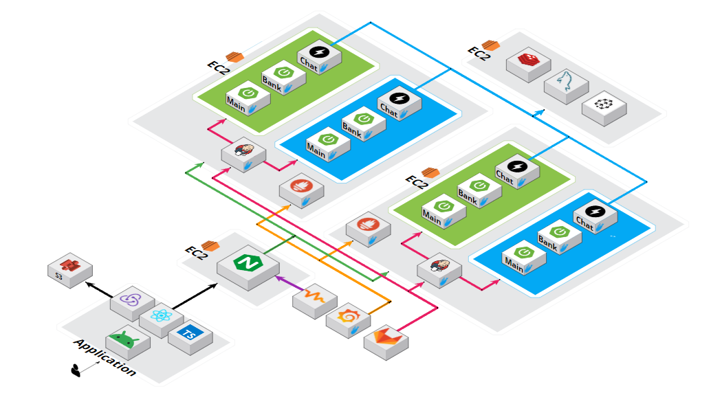

# Benepick


## 📖목차

- [Benepick](#benepick)
  - [📖목차](#목차)
  - [프로젝트 진행 기간](#프로젝트-진행-기간)
  - [❤ 팀 소개](#-팀-소개)
    - [팀명](#팀명)
    - [팀원 소개](#팀원-소개)
    - [Frontend](#frontend)
    - [Backend](#backend)
  - [🎉 프로젝트 요약](#-프로젝트-요약)
  - [✨주요 기능 및 구현](#주요-기능-및-구현)
  - [🖥 서비스 화면](#-서비스-화면)
  - [🏗️ 아키텍쳐](#️-아키텍쳐)
  - [🛠 기술 스택](#-기술-스택)
  - [📂 파일 구조](#-파일-구조)
  - [📝 설계 문서](#-설계-문서)
    - [ERD](#erd)
    - [API](#api)
    - [FIGMA](#figma)
  - [📚 컨벤션](#-컨벤션)
    - [Ground Rule](#ground-rule)
  - [🥇 프로젝트 수칙](#-프로젝트-수칙)
    - [💻 회의 진행](#-회의-진행)
    - [💻 코드 리뷰](#-코드-리뷰)
    - [💻 코드 작성](#-코드-작성)
    - [💻 깃 관리](#-깃-관리)
    - [Git Commit](#git-commit)
    - [Git Branch](#git-branch)
- [브랜치 명명 컨벤션](#브랜치-명명-컨벤션)
  - [Git flow](#git-flow)
    - [Codding](#codding)
    - [Jira](#jira)
  - [💻 구동 방법](#-구동-방법)
  - [💾 결과물](#-결과물)
    - [UCC](#ucc)
    - [시연 영상](#시연-영상)

---

## 프로젝트 진행 기간

`2023.08.21 ~ 2023.10.06 (약 7주)`

---

## ❤ 팀 소개


### 팀명

> 📢 안녕하세요! 핀테크 주제로 프로젝트를 진행한 팀《현실에서는 신용불량자였던 내가 이세계에선 최강의 카드 혜택 마에스트로?》입니다.

### 팀원 소개

### Frontend

|                                                                                                     |                                                                                                 |
| :-------------------------------------------------------------------------------------------------: | :---------------------------------------------------------------------------------------------: |
| <br>**김성용** | <br>**진익근** |

---

### Backend

|                                                                                                     |                                                                                                  |                                                                                                     |                                                                                                  |
| :-------------------------------------------------------------------------------------------------: | :----------------------------------------------------------------------------------------------: | :-------------------------------------------------------------------------------------------------: | :----------------------------------------------------------------------------------------------: |
| <br>**김동겸** | <br>**박시균** | <br>**박현철** | <br>**임혜진** |

---

## 🎉 프로젝트 요약

💡 **프로젝트 명**: 베네픽

**목적**: 보유 카드를 효율적으로 사용하여 혜택을 극대화하고, 더 좋은 카드를 추천 받을 수 있는 서비스

**기대효과**:

- 보유 카드 실적을 효과적으로 관리할 수 있다.
- 카드를 효율적으로 사용하여 최대 혜택을 받을 수 있다.
- 더 좋은 카드를 추천 받을 수 있다.  
  **차별점**:
- 위치 기반 결제 전 혜택 정보 확인(방향에 따른 사업장 선택)

---

## ✨주요 기능 및 구현

💡 **계정**:

1.  휴대폰 인증 (본인인증)

💡 **마이데이터(더미데이터)**:

1.  더미데이터 생성
    1. 사용자
    2. 카드
    3. 소비내역
2.  연동 카드사 선택

💡 **소비 습관**:

1.  카테고리 별 소비내역 조회
    1. 기간 별 소비내역
    2. 카테고리 별 소비내역
    3. 통계 그래프

💡 **내 카드**:

1.  실적 모아보기
2.  혜택 조회
    1. 받은 혜택 금액
    2. 받을 수 있는 혜택 금액
3.  소비내역 조회

💡 **검색(추천)**:

1.  위치 기반 추천
    1. 위치별 사업장 조회
    2. 제스처 기능을 통한 빠른 추천 알림 → 실사용성 고려
2.  혜택 기반 추천(챗봇)
    1. 가맹점에 따른 사용 카드 추천 (내 카드, 신규 카드)
    2. 소비패턴에 따른 신규 카드 추천

💡 **결제 테스트**:

1.  시연을 위한 결제 데이터 추가

---

## 🖥 서비스 화면

<summary>메인 페이지</summary>
<div markdown="1">


</div>

<summary>회원가입 페이지</summary>
<div markdown="1">


</div>

<summary>혜택찾기</summary>
<div markdown="1">

</div>

<summary>내 카드 페이지</summary>

<div markdown="1">


</div>

<summary>내 소비 페이지</summary>

<div markdown="1">

</div>

<summary>챗봇페이지</summary>
<div markdown="1">

</div>

<summary>알람 페이지</summary>

<div markdown="1">

</div>

---

## 🏗️ 아키텍쳐



---

## 🛠 기술 스택

<div align=center>
<!-- 백엔드 -->


<!-- 데이터베이스 -->


 
<!-- 프론트엔드 -->


<!-- 인프라 -->


 

</div>

---

## 📂 파일 구조

<details  style="margin-left: 5px;">
<summary><b>프론트 프로젝트 구조</b></summary>
<div>

```
📦src
 ┣ 📂api
 ┣ 📂common
 ┃ ┣ 📂assets
 ┃ ┃ ┣ 📂fonts
 ┃ ┃ ┣ 📂icons
 ┃ ┃ ┣ 📂images
 ┃ ┃ ┃ ┣ 📂logo
 ┃ ┣ 📂components
 ┃ ┃ ┣ 📂progress
 ┃ ┃ ┃ ┣ 📂childs
 ┃ ┣ 📂design
 ┃ ┗ 📂utils
 ┣ 📂hooks
 ┣ 📂interfaces
 ┣ 📂navigator
 ┃ ┣ 📂stacks
 ┣ 📂pages
 ┃ ┣ 📂auth
 ┃ ┃ ┣ 📂Login
 ┃ ┃ ┣ 📂PersonalAuth
 ┃ ┃ ┣ 📂PhoneAuth
 ┃ ┃ ┃ ┣ 📂Components
 ┃ ┃ ┣ 📂ReadTerms
 ┃ ┃ ┣ 📂RegistrationComplete
 ┃ ┃ ┣ 📂SelectCard
 ┃ ┃ ┣ 📂SelectCompany
 ┃ ┃ ┣ 📂SetPassword
 ┃ ┃ ┣ 📂Start
 ┃ ┃ ┗ 📂Terms
 ┃ ┣ 📂Loading
 ┃ ┣ 📂main
 ┃ ┃ ┣ 📂Benefit
 ┃ ┃ ┃ ┣ 📂Container
 ┃ ┃ ┣ 📂ChatBot
 ┃ ┃ ┃ ┣ 📂Container
 ┃ ┃ ┣ 📂Consumption
 ┃ ┃ ┃ ┣ 📂Container
 ┃ ┃ ┃ ┃ ┣ 📂ConsumptionHistory
 ┃ ┃ ┃ ┃ ┣ 📂MonthlyBenefit
 ┃ ┃ ┣ 📂CreditCard
 ┃ ┃ ┃ ┣ 📂Container
 ┃ ┃ ┃ ┃ ┣ 📂progress
 ┃ ┃ ┃ ┃ ┃ ┣ 📂childs
 ┃ ┃ ┣ 📂CreditCardDetail
 ┃ ┃ ┃ ┣ 📂Container
 ┃ ┃ ┃ ┃ ┣ 📂CardConsumption
 ┃ ┃ ┃ ┃ ┣ 📂DateOption
 ┃ ┃ ┗ 📂Home
 ┃ ┃ ┃ ┣ 📂Container
 ┃ ┣ 📂Notification
 ┃ ┃ ┣ 📂Container
 ┃ ┣ 📂setting
 ┃ ┃ ┣ 📂ChangePassword
 ┃ ┃ ┣ 📂CheckPassword
 ┃ ┃ ┣ 📂CompanyConnection
 ┃ ┃ ┃ ┣ 📂Container
 ┃ ┃ ┗ 📂Setting
 ┃ ┃ ┃ ┣ 📂Container
 ┣ 📂store
 ┃ ┣ 📂slices
 ┗ 📜README.md
```

</div>
</details>
<br>
<details  style="margin-left: 5px;">
<summary><b>백엔드 프로젝트 구조</b></summary>
<div>

```
📦benepick
 ┣ 📂domain
 ┃ ┣ 📂card
 ┃ ┃ ┣ 📂controller
 ┃ ┃ ┣ 📂dto
 ┃ ┃ ┃ ┣ 📂request
 ┃ ┃ ┃ ┗ 📂response
 ┃ ┃ ┣ 📂repository
 ┃ ┃ ┗ 📂service
 ┃ ┣ 📂mydata
 ┃ ┃ ┣ 📂controller
 ┃ ┃ ┣ 📂dto
 ┃ ┃ ┃ ┣ 📂request
 ┃ ┃ ┃ ┗ 📂response
 ┃ ┃ ┗ 📂service
 ┃ ┗ 📂user
 ┃ ┃ ┣ 📂controller
 ┃ ┃ ┣ 📂dto
 ┃ ┃ ┃ ┣ 📂request
 ┃ ┃ ┃ ┗ 📂response
 ┃ ┃ ┣ 📂entity
 ┃ ┃ ┣ 📂repository
 ┃ ┃ ┗ 📂service
 ┣ 📂global
 ┃ ┣ 📂api
 ┃ ┃ ┣ 📂dto
 ┃ ┃ ┃ ┣ 📂request
 ┃ ┃ ┃ ┗ 📂response
 ┃ ┃ ┗ 📂service
 ┃ ┣ 📂config
 ┃ ┣ 📂exception
 ┃ ┣ 📂interceptor
 ┃ ┣ 📂log
 ┃ ┃ ┣ 📂annotation
 ┃ ┃ ┣ 📂logTrace
 ┃ ┣ 📂response
 ┃ ┗ 📂util
 ┗ 📜BenepickApplication.java
```

</div>
</details>

---

## 📝 설계 문서

### ERD

<details>
<summary>ERD</summary>
<div markdown="1">       
    
</div>
</details>

### API

<details>
<summary>전체 문서</summary>
<div markdown="1">       
    
</div>
</details>

<details>
<summary>Request</summary>
<div markdown="1">       
    
</div>
</details>

<details>
<summary>Response</summary>
<div markdown="1">       
    
</div>
</details>

### FIGMA

<details>
<summary>WIREFRAME</summary>
<div markdown="1">       
    
</div>
</details>

---

## 📚 컨벤션

### Ground Rule

<details>
  <summary>클릭하여 내용 표시/숨기기</summary>

> GROUND RULE

## 🥇 프로젝트 수칙

### 💻 회의 진행

1. 매일 오전 9시, 오후 5시 2회에 걸쳐 **데일리 스크럼(Daily Scrum)**을 진행해, 개인별 당일 목표를 설정하고 진행 상황을 공유합니다.
2. 매주 금요일 오후 5시에 **스프린트 세션(Sprint Session)**을 진행해 일주일간 프로젝트의 진행 상황 및 추후 진행 목표를 설정합니다.
3. 데일리 스크럼과 스프린트 세션은 팀장이 회의를 주재하고, 다른 팀원들이 돌아가며 회의록을 작성합니다.
4. 회의에 적극적으로 참여하고, 팀장의 지목에 따라 본인의 의견을 반드시 제시합니다.

### 💻 코드 리뷰

1. **코드 리뷰(Code Review)**는 점심시간을 활용해 필요한 부분만 간단히 30분 동안 진행합니다.
2. 서로 다른 코드 스타일을 합의한 **코딩 컨벤션(Coding Convention)**에 따라 일원화합니다.
3. 코드 리뷰는 우선순위에 따라 빠르게 진행하며, 사소한 의견을 반영할 지에 대한 부분은 코드 작성자가 선택할 수 있도록 합니다.

### 💻 코드 작성

1. 에러(Error)가 발생 시 1시간 정도는 혼자서 고민해보고, 해결이 되지 않을 경우 팀원들과 바로 공유합니다.
2. 에러를 해결하기 위해 고민한 내용 및 해결 과정은 노션에 정리하여 공유합니다.
3. 코드에 **주석(Comment)을 작성**하는 습관을 생활화하여, 다른 팀원들이 내가 작성한 코드를 이해하기 쉽도록 합니다.
4. 기능의 구현 원리를 공부하고 파악하기 위해서 오픈 소스(Open Source) 라이브러리 사용을 최소화하는 것을 원칙으로 합니다.

### 💻 깃 관리

1. 풀리퀘스트(Pull Request)가 있을 경우, 이를 확인했다는 의미에서 최소한 1개 이상의 의견을 남겨야 합니다.
2. 풀리퀘스트 시 의견 갈등이 생겼다면, 충분한 토론과 의견 수렴 과정을 거쳐 **다수의 의견**을 따라야 합니다.
3. 커밋(Commit)하기 전에 고칠 부분을 한 번 더 점검합니다.
4. 1가지 기능 또는 1가지 함수를 새로 만들 때마다 커밋하는 습관을 생활화합니다.
5. **커밋 메시지(Commit Message)**는 합의한 **커밋 컨벤션(Commit Convention)**에 따라 최대한 상세하게 작성합니다.
6. 깃 브랜치(Branch) 규칙에 따라 브랜치를 관리하고, 모든 작업은 올바른 브랜치에서 작업해야 합니다.

</details>

### Git Commit

<details>
  <summary>클릭하여 내용 표시/숨기기</summary>
    
> COMMIT CONVENTION
>

- **Commit 메세지 구조**
  - ex) ✨ feat : Add sign in page #S09P11A308-52

```
<emoji> <type> : <subject> <Jira ticket number> // 필수
// 빈 행으로 구분
<body>      // 생략가능
// 빈 행으로 구분
<footer>    // 생략가능
```

</details>

### Git Branch

<details>
  <summary>클릭하여 내용 표시/숨기기</summary>

# 브랜치 명명 컨벤션

> BRANCH NAMING CONVENTION

## Git flow

- ex) **feat/{이슈 키}-{BE/FE}-{이슈 요약}**

- **master** / **main** - 제품으로 출시 및 배포가 가능한 상태인 브랜치 → 최종 결과물 제출 용도
- **develop** - 다음 출시 버전을 개발하는 브랜치 → 기능 완성 후 중간에 취합하는 용도
- **feature** - 각종 기능을 개발하는 브랜치 → feat/login, feat/join 등으로 기능 분류 후 작업
- **hotfix** - 출시 버전에서 발생한 버그를 수정하는 브랜치

</details>

### Codding

<details>
  <summary>클릭하여 내용 표시/숨기기</summary>

> CODING CONVENTION

- 1문자의 이름은 사용하지 않는다.
- 네임스페이스, 오브젝트, 함수 그리고 인스턴스에는 camelCase를 사용한다 `ex) camelCase`
- 클래스나 constructor에는 PascalCase를 사용한다. `ex) PascalCase`
- 약어 및 이니셜은 항상 모두 대문자이거나 모두 소문자여야 한다. `ex) NFT`
- 클래스명과 변수명은 `명사 사용`
- 메서드명은 `동사 사용`
- 상수명은 대문자를 사용하고, 단어와 단어 사이는 \_로 연결한다.
- component는 PascalCase를 사용한다.

</details>

### Jira

<details>
  <summary>클릭하여 내용 표시/숨기기</summary>

> JIRA CONVENTION

1. 매주 월요일 오전 스크럼 회의 이후 각자의 이슈 티켓을 생성한다.
2. 이슈 생성 시 확인해야 할 부분
   - **\*\*\*\***\*\*\*\***\*\*\*\***\*\***\*\*\*\***\*\*\*\***\*\*\*\***\*\*\*\***\*\*\*\***\*\*\*\***\*\*\*\***\*\***\*\*\*\***\*\*\*\***\*\*\*\***담당자가 본인**\*\*\*\***\*\*\*\***\*\*\*\***\*\***\*\*\*\***\*\*\*\***\*\*\*\***\*\*\*\***\*\*\*\***\*\*\*\***\*\*\*\***\*\***\*\*\*\***\*\*\*\***\*\*\*\***으로 설정되어 있는지
   - **컴포넌트**가 지정되어 있는지 (FE, BE, 공통 중 택1)
   - **Epic Link**가 지정되어 있는지 (설계, FE개발, BE개발, 회의, 학습…)
   - 스프린트의 **총 Story Points가 40 이상**인지
3. 이슈 티켓 이름은 **\*\***\*\***\*\***[말머리] 구체적인 기능**\*\***\*\***\*\*** 으로 적는다.
   - \***\*\*\*\*\*\*\***\*\*\*\*\***\*\*\*\*\*\*\***기능 관련 이슈일 경우 **\*\***\*\***\*\***[말머리]**\*\***\*\***\*\***는 기능 명세서의 대분류를 따른다.
4. 매일 오전 스크럼 회의 이후 그 날 처리할 이슈 티켓을 **진행 중**으로 이동시킨다.
   - 실시간으로 이슈를 처리할 때마다 **완료** 처리한다.

</details>

<!-- ## 📄 문서 정리

### 회의록

<details>
<summary>페이지 전체 모습</summary>
<div markdown="1">
    
    
    
</div>
</details>

<details>
<summary>기획 회의록 페이지 세부 모습</summary>
<div markdown="1">
    
</div>
</details>
<details>
<summary>스크럼 페이지 세부 모습</summary>
<div markdown="1">
    
</div>
</details>
<details>
<summary>스프린트 페이지 세부 모습</summary>
<div markdown="1">
    
</div>
</details>

### 버그 리포트
<details>
<summary>페이지 전체 모습</summary>
<div markdown="1">
    
</div>
</details>
<details>
<summary>세부 페이지 모습</summary>
<div markdown="1">
    
</div>
</details>

### 지식 공유

<details>
<summary>페이지 전체 모습</summary>
<div markdown="1">
    
</div>
</details>
<details>
<summary>세부 페이지 모습</summary>
<div markdown="1">
    
</div>
</details>

--- -->

## 💻 구동 방법

[포팅메뉴얼 참조](./exec/포팅매뉴얼_A610.pdf)

---

## 💾 결과물

### UCC

https://youtu.be/ohmziXA1uHU

### 시연 영상

https://youtu.be/KMJX3GOS7eo
